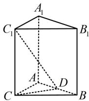
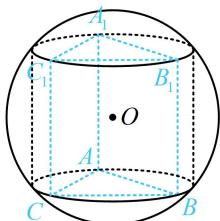

> [!faq]- 《第3节 外接球问题》参考答案
>
> > [!success]- **【答案】** 详见解析
>
> > [!note]- **【分析】**
> > 本题未单列分析。
>
> > [!note]- **【解析】**
> > 所以 $CD = 6 \times \frac{\sqrt{3}}{2} = 3\sqrt{3}$
> >
> > 又 $ABC - A_{1}B_{1}C_{1}$ 是直三棱柱，所以 $CC_{1}\perp$ 平面 $ABC$
> >
> > 故 $\angle CDC_{1}$ 即为直线 $DC_{1}$ 与平面 $ABC$ 所成的角，
> >
> > 由题意， $\tan \angle CDC_{1} = \frac{CC_{1}}{CD} = 1$ ，所以 $CC_{1} = CD = 3\sqrt{3}$
> >
> > 直三棱柱外接球问题可按内容提要第2点②的圆柱模型处理，如图2，模型的核心方程是 $r^2 +\left(\frac{h}{2}\right)^2 = R^2$
> >
> > 由题意， $\triangle ABC$ 的外接圆半径 $r = 6\times \frac{\sqrt{3}}{2}\times \frac{2}{3} = 2\sqrt{3}$
> >
> > 圆柱的高 $h = CC_{1} = 3\sqrt{3}$ ，所以 $R = \sqrt{r^2 + \left(\frac{h}{2}\right)^2} = \frac{5\sqrt{3}}{2}$
> >
> > 故外接球的表面积 $S = 4\pi R^2 = 75\pi$
> >
> >   
> > 图1
> >
> >   
> > 图2
