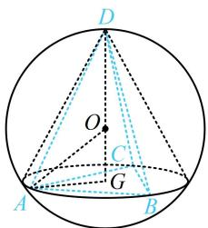

> [!faq]- 《第3节 外接球问题》参考答案
>
> > [!success]- **【答案】** B
>
> > [!note]- **【分析】**
> > 本题未单列分析。
>
> > [!note]- **【解析】**
> > B
> >
> > $$
> > \triangle A B C
> > $$
> >
> > 大，此时三棱锥 $D - ABC$ 应为如图所示的正三棱锥，
> >
> > 正三棱锥可按圆锥模型处理，核心是到 $\triangle AOG$ 中用勾股定理计算有关量，下面先算 $\triangle ABC$ 的外接圆半径 $r$
> >
> > 设 $\triangle ABC$ 边长为 $a$ ，则 $\frac{1}{2} \cdot a^2 \cdot \frac{\sqrt{3}}{2} = 9\sqrt{3} \Rightarrow a = 6$ ，
> >
> > 由正弦定理， $\frac{6}{\sin 60^{\circ}} = 2r\Rightarrow r = 2\sqrt{3}\Rightarrow AG = 2\sqrt{3}$
> >
> > 又由题意， $OA = OD = 4$ ，所以 $OG = \sqrt{OA^2 - AG^2} = 2$
> >
> > 故 $(V_{D - ABC})_{\mathrm{max}} = \frac{1}{3}\times 9\sqrt{3}\times (2 + 4) = 18\sqrt{3}$
> >
> > 
