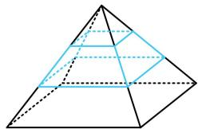
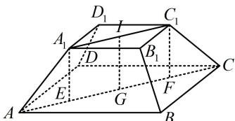
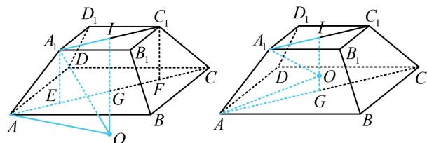

> [!faq]- 《第3节 外接球问题》参考答案
>
> > [!success]- **【答案】** $10\pi$
>
> > [!note]- **【分析】**
> > 本题未单列分析。
>
> > [!note]- **【解析】**
> > 解析：如图1，侧棱所有三等分点构成的图形为正四棱台，后续计算必会用到正四棱台的有关数据，故先计算它们，
> >
> >   
> > 图1
> >
> >   
> > 图2
> >
> > 因为原正四棱锥所有棱长都为3，正四棱台的顶点都是侧棱的三等分点，所以其上、下底面边长分别为1和2，侧棱长为1，如图2，作 $A_{1}E\perp AC$ 于 $E$ ， $C_1F\perp AC$ 于 $F$
> >
> > 则 $A_{1}E$ 和 $C_1F$ 都等于正四棱台的高，
> >
> > 且 $AE = CF = \frac{1}{2} (AC - A_1C_1) = \frac{1}{2}\times (2\sqrt{2} -\sqrt{2}) = \frac{\sqrt{2}}{2},$
> >
> > $A_{1}E = \sqrt{AA_{1}^{2} - AE^{2}} = \frac{\sqrt{2}}{2}$ ，所以 $IG = \frac{\sqrt{2}}{2}$ ，其中 $I$ ， $G$ 分别为上下底面中心，问题的球即为正四棱台的外接球，不清楚球心在台体外还是台体内，需分别考虑，
> >
> > 设正四棱台的外接球半径为 $R$ ，若为图3，则 $IG = OI - OG$
> >
> > $$
> > = \sqrt {O A _ {1} ^ {2} - A _ {1} I ^ {2}} - \sqrt {O A ^ {2} - A G ^ {2}} = \sqrt {R ^ {2} - \frac {1}{2} - \sqrt {R ^ {2} - 2}},
> > $$
> >
> > 又 $IG = \frac{\sqrt{2}}{2}$ ，所以 $\sqrt{R^2 - \frac{1}{2}} -\sqrt{R^2 - 2} = \frac{\sqrt{2}}{2},$
> >
> > 故 $\sqrt{R^2 - \frac{1}{2}} = \frac{\sqrt{2}}{2} +\sqrt{R^2 - 2}$
> >
> > 两端平方得： $R^2 -\frac{1}{2} = \frac{1}{2} +\sqrt{2(R^2 - 2)} +R^2 -2,$
> >
> > 化简得： $\sqrt{2(R^2 - 2)} = 1$ ，所以 $2(R^{2} - 2) = 1$
> >
> > 解得： $R = \frac{\sqrt{10}}{2}$ ，故球 $O$ 的表面积为 $S = 4\pi R^2 = 10\pi$
> >
> > 若为图4，则球心 $O$ 在线段 $IG$ 上，
> >
> > 所以 $OA = \sqrt{AG^2 + OG^2} = \sqrt{2 + OG^2}\geq \sqrt{2}$
> >
> > $OA_{1} = \sqrt{A_{1}I^{2} + O I^{2}} = \sqrt{\frac{1}{2} + O I^{2}}\leq \sqrt{\frac{1}{2} + IG^{2}} = 1,$
> >
> > 从而 $OA > OA_{1}$ ，故球心 $O$ 不可能在台体内；
> >
> > 综上所述，只可能是图3的情形，且正四棱台的外接球的表面积 $S = 10\pi$
> >
> > 图3  
> >   
> > 图4
