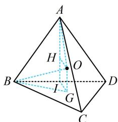

> [!faq]- 《第3节 外接球问题》参考答案
>
> > [!success]- **【答案】** $\frac{105\pi}{2}$
>
> > [!note]- **【分析】**
> > 本题未单列分析。
>
> > [!note]- **【解析】**
> > 解析：没有线面垂直、侧棱长相等，不便套用模型，注意到 $\triangle BCD$ 的外心好找，故考虑内容提要中的通法，
> >
> > $$
> > \triangle B C D
> > $$
> >
> > 则球心 $O$ 在该直线上，取 $BD$ 中点 $I$ ，连接 $AI$
> >
> > 因为 $AB = AD = 3\sqrt{3}$ ， $BI = 3$ ，所以 $AI \perp BD$ ，
> >
> > 且 $AI = \sqrt{AB^2 - BI^2} = 3\sqrt{2}$ ，结合平面 $ABD\perp$ 平面BCD
> >
> > 可得 $AI \perp$ 平面 $BCD$ ，所以 $AI \parallel OG$
> >
> > 作 $OH \perp AI$ 于 $H$ ，则 $OH = IG = \frac{1}{3} \times 6 \times \frac{\sqrt{3}}{2} = \sqrt{3}$ ，
> >
> > 要求外接球半径，可先设 $OG$ ，利用 $OA = OB$ 来建立方程， $OA$ ， $OB$ 分别在 $\triangle AHO$ 和 $\triangle BGO$ 中计算，
> >
> > 设 $OG = x$ ，则 $HI = x$ ， $AH = AI - HI = 3\sqrt{2} -x$
> >
> > 所以 $OA = \sqrt{AH^2 + OH^2} = \sqrt{(3\sqrt{2} - x)^2 + 3}$
> >
> > 又 $BG = \frac{2}{3}\times 6\times \frac{\sqrt{3}}{2} = 2\sqrt{3}$
> >
> > 所以 $OB = \sqrt{BG^2 + OG^2} = \sqrt{12 + x^2}$ ，由 $OA = OB$ 可得
> >
> > $\sqrt{(3\sqrt{2}-x)^{2}+3}=\sqrt{12+x^{2}}$ ，解得： $x=\frac{3}{2\sqrt{2}}$ ，
> >
> > 所以球 $O$ 的半径 $R = OB = \sqrt{12 + x^2} = \sqrt{\frac{105}{8}}$
> >
> > 故球 $O$ 的表面积 $S = 4\pi R^2 = \frac{105\pi}{2}$
> >
> > 
>
> > [!tip]- **【反思】**
> > 涉及面面垂直的外接球问题，其实也算一类模型，但由于此类问题用通法计算比较方便（因为过外心的垂线容易作出与分析），故本节没有单独归类.
