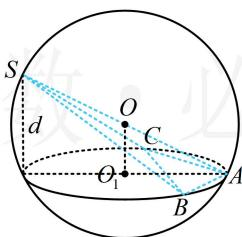
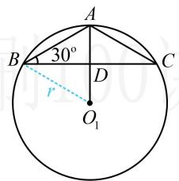

> [!faq]- 《第3节 外接球问题》参考答案
>
> > [!success]- **【答案】** C
>
> > [!note]- **【分析】**
> > 本题未单列分析。
>
> > [!note]- **【解析】**
> > 解析：本题不能套用模型，考虑通法. 直径为 $SA$ ，球心 $O$ 即 $SA$ 中点，连接 $O$ 与 $\triangle ABC$ 的外心即得面 $ABC$ 的垂线，如图1，设 $\triangle ABC$ 的外心为 $O_{1}$ ，外接圆半径为 $r$ 则 $\left\{ \begin{array}{l} \angle BAC = 120^{\circ} \\ BC = \sqrt{3} \end{array} \right. \Rightarrow \frac{BC}{\sin \angle BAC} = 2 = 2r \Rightarrow r = 1$ 球 $O$ 的直径 $SA = 4 \Rightarrow$ 半径 $R = 2$ ，所以球心 $O$ 到平面 $ABC$ 的距离 $OO_{1} = \sqrt{R^{2} - r^{2}} = \sqrt{3}$ 又 $O$ 是 $SA$ 的中点，所以点 $S$ 到平面 $ABC$ 的距离 $d = 2OO_{1} = 2\sqrt{3}$ ，算体积还差 $\triangle ABC$ 的面积，如图2，设 $D$ 为 $BC$ 中点，则 $AD \perp BC$ ，且 $\angle ABD = 30^{\circ}$ 所以 $AD = BD \cdot \tan 30^{\circ} = \frac{\sqrt{3}}{2} \times \frac{\sqrt{3}}{3} = \frac{1}{2}$ 从而 $S_{\triangle ABC} = \frac{1}{2} BC \cdot AD = \frac{1}{2} \times \sqrt{3} \times \frac{1}{2} = \frac{\sqrt{3}}{4}$ 故 $V_{S-ABC} = \frac{1}{3} S_{\triangle ABC} \cdot d = \frac{1}{3} \times \frac{\sqrt{3}}{4} \times 2\sqrt{3} = \frac{1}{2}$ .
> >
> >   
> > 图1
> >
> >   
> > 图2
