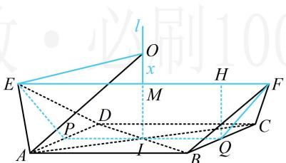

> [!faq]- 《第3节 外接球问题》参考答案
>
> > [!success]- **【答案】** D
>
> > [!note]- **【分析】**
> > 本题未单列分析。
>
> > [!note]- **【解析】**
> > 解析：所给图形没有常见的外接球模型可套，故考虑通法，即通过分析几何关系来找球心。可选一个面，过其外心作该面的垂线，则球心在该垂线上，选哪个面呢？观察发现若选择矩形ABCD来作该垂线，则图形相对比较简单，如图，设 $AC \cap BD = I$ ，过 $I$ 作平面ABCD的垂线 $l$ ，则空间中到 $A, B, C, D$ 四点距离相等的点必在 $l$ 上，
> >
> > 所以羡除 $ABCDEF$ 的外接球球心 $O$ 只能在 $l$ 上，由羡除的对称性， $l$ 与 $EF$ 相交，且交点 $M$ 为 $EF$ 的中点，怎样确定 $O$ 的具体位置？注意到 $O$ 应满足 $OA = OE$ ，故可设 $OM = x$ ，由 $OA = OE$ 建立方程求出 $x$ ，找到 $O$ 的位置，设 $OM = x$ ，则 $OE = \sqrt{OM^2 + EM^2} = \sqrt{OM^2 + \frac{1}{4} EF^2}$ $= \sqrt{x^2 + \frac{9}{4}}$ ， $OA = \sqrt{OI^2 + IA^2} = \sqrt{(x + MI)^2 + \frac{1}{4} AC^2}$ $= \sqrt{(x + MI)^2 + \frac{5}{4}}$ ①，
> >
> > 故还需算 $MI$ ，可到如图所示的等腰梯形EFQP中来算，
> >
> > 设 $P$ ， $Q$ 分别为 $AD$ ， $BC$ 中点，则 $PQ = AB = 2$
> >
> > $PE = QF = \frac{\sqrt{3}}{2}$ ，作 $QH\perp EF$ 于点 $H$
> >
> > 则 $HF = \frac{1}{2} (EF - PQ) = \frac{1}{2} \times (3 - 2) = \frac{1}{2}$ ,
> >
> > 所以 $QH = \sqrt{QF^2 - HF^2} = \frac{\sqrt{2}}{2}$ ，故 $MI = QH = \frac{\sqrt{2}}{2}$
> >
> > 代入①得 $OA = \sqrt{\left(x + \frac{\sqrt{2}}{2}\right)^2 + \frac{5}{4}}$ ，因为 $OA = OE$
> >
> > 所以 $\sqrt{\left(x + \frac{\sqrt{2}}{2}\right)^2 + \frac{5}{4}} = \sqrt{x^2 + \frac{9}{4}}$ ，解得： $x = \frac{1}{2\sqrt{2}}$
> >
> > 故羡除的外接球半径 $R = OE = \sqrt{x^2 + \frac{9}{4}} = \sqrt{\frac{19}{8}}$
> >
> > 表面积 $S = 4\pi R^2 = \frac{19\pi}{2}$
> >
> > 
