<!-- source-part:1 pages:1-8 -->

# 第3节 外接球问题（★★★☆）

## 内容提要

本节归纳外接球问题，有四大模型，下面分别分析.

1. 长方体模型：如图1，长、宽、高分别为 $a, b, c$ 的长方体外接球半径 $R = \frac{1}{2}\sqrt{a^2 + b^2 + c^2}$ ，除了标准的长方体（包括正方体）之外，还有下面的两个三棱锥模型，也常通过补形转化为长方体模型来处理.

①垂直模型: 如图 2 和图 3, 其共同特征是过直角 $\triangle ABC$ 的一个顶点 (图 2 是直角顶点, 图 3 是斜边端点) 作垂直于平面 $ABC$ 的线段, 这一特征可作为解题时识别模型的依据.

②对棱相等模型：如图4，三棱锥 $S - ABC$ 满足三组相对棱相等，即 $AB = SC$ ， $AC = SB$ ， $BC = SA$ ，则该三棱锥也可补形为长方体处理.

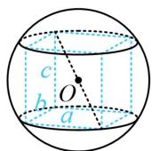  
图1

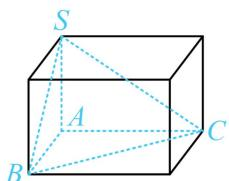  
图2

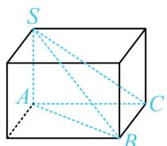  
图3

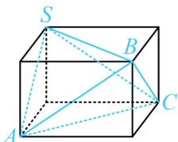  
图4

2. 圆柱模型：如图5，圆柱的底面半径 $r$ ，高 $h$ 和球的半径 $R$ 满足 $r^2 + \left(\frac{h}{2}\right)^2 = R^2$ ．除了标准的圆柱模型外，还有一些模型也可转化为圆柱模型处理.

①线面垂直的三棱锥：如图6， $SA \perp$ 平面 $ABC$ ，若 $\triangle ABC$ 是直角三角形，则按上面1中的长方体模型处理最方便，若不是直角三角形，则可先将三棱锥 $S - ABC$ 放入圆柱，按圆柱模型处理.

②直三棱柱：如图7所示的直三棱柱也可按圆柱模型处理，本质上和图6的模型相同.

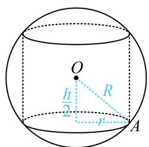  
图5

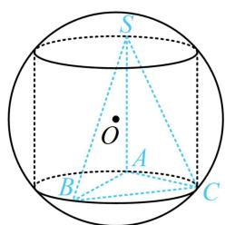  
图6

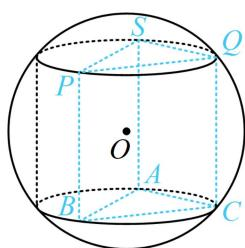  
图7

3. 圆锥模型: 如图8和图9, 圆锥的高 $PO_{1}=h$ , 底面半径 $AO_{1}=r$ , 球的半径为R, 则 $OO_{1}=\left|h-R\right|$ , 在 $\triangle AOO_{1}$ 中, 有 $\left|h-R\right|^{2}+r^{2}=R^{2}$ , 故圆锥的外接球相关计算抓住 $\triangle AOO_{1}$ 即可. 除了标准的圆锥模型, 对于侧棱相等的棱锥, 也可放到圆锥中考虑, 如图10的三棱锥P-ABC.

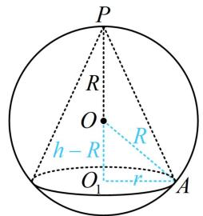  
图8

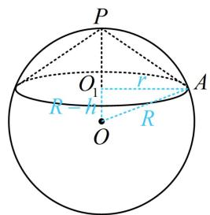  
图9

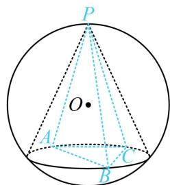  
图10

4. 台体模型：如图11，圆台的上、下底面半径分别为 $r_1$ ， $r_2$ ，高 $O_1O_2 = h$ ，球 $O$ 的半径为 $R$ ，则它们满足方程 $\sqrt{R^2 - r_1^2} + \sqrt{R^2 - r_2^2} = h$ ；若为图12，则满足的方程是 $\sqrt{R^2 - r_1^2} - \sqrt{R^2 - r_2^2} = h$ 。除了这两种标准的圆台模型外，棱台模型也可转化为圆台模型处理，如图13，这种情况只需求出棱台的上、下底面外接圆半径，即可放入圆台分析。

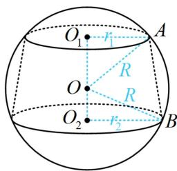  
图11

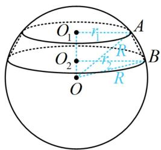  
图12

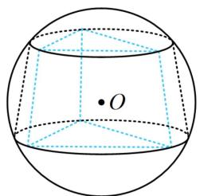  
图13

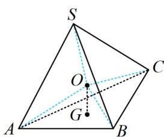  
图14

在外接球问题中，若看不出来是什么模型，则可以尝试用通法：先找到某个面的外接圆圆心，过圆心作该面的垂线，则球心必定在该垂线上，再利用球心到各顶点距离相等构造方程。如上图14，过 $\triangle ABC$ 的外心 $G$ 作平面 $ABC$ 的垂线，则球心 $O$ 必在该垂线上，再由 $OS = OA$ 建立方程求三棱锥 $S - ABC$ 的外接球半径。仔细思考便可发现，其实上述2，3，4模型本质上都是利用的该方法，只是将几何体的结构类型进行了细分，更方便大家理解而已。注意：虽然此通法理论上适用于所有外接球问题，但只有圆心好找且垂线易作时才方便使用。

![[高中/总复习/教辅/一数常规版2026/第9章 立体几何、空间向量/模块1 立体图形的结构探究/第3节 外接球问题/类型01_外接球的长方体模型/类型01_外接球的长方体模型.md]]
![[高中/总复习/教辅/一数常规版2026/第9章 立体几何、空间向量/模块1 立体图形的结构探究/第3节 外接球问题/类型02_外接球的圆柱模型/类型02_外接球的圆柱模型.md]]
![[高中/总复习/教辅/一数常规版2026/第9章 立体几何、空间向量/模块1 立体图形的结构探究/第3节 外接球问题/类型03_外接球的圆锥模型/类型03_外接球的圆锥模型.md]]
![[高中/总复习/教辅/一数常规版2026/第9章 立体几何、空间向量/模块1 立体图形的结构探究/第3节 外接球问题/类型04_外接球的台体模型/类型04_外接球的台体模型.md]]
![[高中/总复习/教辅/一数常规版2026/第9章 立体几何、空间向量/模块1 立体图形的结构探究/第3节 外接球问题/强化训练/强化训练.md]]
