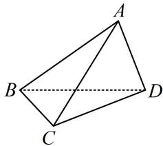

<!-- question-source:start -->
【例 2】如图，在三棱锥 A-BCD 中，AB=AC=BD=CD=3，AD=BC=2，则三棱锥 A-BCD 的外接球的表面积为 \_\_\_\_.

<!-- question-source:end -->

![[高中/总复习/教辅/一数常规版2026/第9章 立体几何、空间向量/模块1 立体图形的结构探究/第3节 外接球问题/类型01_外接球的长方体模型/例题/answers/Q00050536A1.md]]
