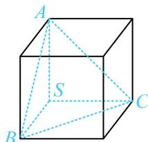

> [!faq]- 《第3节 外接球问题》例题解析
>
> > [!success]- **【答案】** 详见解析
>
> > [!note]- **【分析】**
> > 本题未单列分析。
>
> > [!note]- **【解析】**
> > 解析：如图，正三棱锥的三个侧面两两垂直 $\Rightarrow$ 该正三棱锥的三条侧棱两两垂直，由此可看出属于内容提要第1点①中的长方体模型，
> >
> > $SA = SB = SC = \sqrt{3} \Rightarrow$ 外接球半径 $R = \frac{1}{2}\sqrt{SA^2 + SB^2 + SC^2} = \frac{3}{2}$ ，表面积 $S = 4\pi R^2 = 9\pi$ 。
> >
> > 
> >
> > $$
> > 9 \pi
> > $$
>
> > [!tip]- **【反思】**
> > 有三条共顶点且两两垂直的棱的三棱锥是最基础且好发现的墙角模型，该模型可补形为长方体，按长方体算外接球半径.
