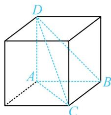

> [!faq]- 《第3节 外接球问题》例题解析
>
> > [!success]- **【答案】** $\frac{9\pi}{2}$
>
> > [!note]- **【分析】**
> > 本题未单列分析。
>
> > [!note]- **【解析】**
> > 解析：由 $AB \perp BC$ 和 $DA \perp$ 平面 $ABC$ 识别出几何体属于内容提要1中的①，可补形为长方体模型处理，
> >
> > 如图，三棱锥 D-ABC 的外接球半径 $R=\frac{1}{2}\sqrt{DA^{2}+AB^{2}+BC^{2}}=\frac{3}{2}$ ,
> >
> > 所以球 $O$ 的体积 $V = \frac{4}{3}\pi R^3 = \frac{9\pi}{2}$ .
> >
> > 
>
> > [!tip]- **【反思】**
> > 过直角三角形顶点作三角形所在平面的垂线段，这样构成的三棱锥可补形为长方体模型，若把这里面的直角三角形改为非直角三角形呢？此时可按后面类型Ⅱ的圆柱模型处理.
