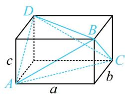

> [!faq]- 《第3节 外接球问题》例题解析
>
> > [!success]- **【答案】** $11\pi$
>
> > [!note]- **【分析】**
> > 本题未单列分析。
>
> > [!note]- **【解析】**
> > 解析：由所给数据可发现三组对棱长度分别相等，属内容提要第1点中的②，可放入长方体考虑，
> >
> > 如图，设长方体的长、宽、高分别为 $a, b, c$ ，则 $\left\{ \begin{array}{l} AB = CD = \sqrt{a^2 + c^2} = 3 \\ AD = BC = \sqrt{b^2 + c^2} = 2 \\ AC = BD = \sqrt{a^2 + b^2} = 3 \end{array} \right.$ ，
> >
> > 三式平方相加得 $a^2 + b^2 + c^2 = 11$ ，所以外接球半径 $R = \frac{\sqrt{a^2 + b^2 + c^2}}{2} = \frac{\sqrt{11}}{2}$ ，故三棱锥 $A - BCD$ 的外接球的表面积 $S = 4\pi R^2 = 11\pi$ 。
> >
> > 
