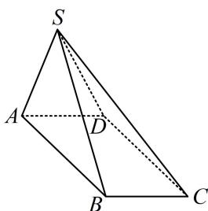

<!-- question-source:start -->
【变式】如图，四棱锥 $S - ABCD$ 的底面 $ABCD$ 为矩形， $SA \perp AB$ ， $SB = SC = 2$ ， $SA = AD = 1$ ，则四棱锥 $S - ABCD$ 的外接球的表面积为（）

A. $\frac{13\pi}{3}$ B. $4\pi$ C. $\frac{10\pi}{3}$ D. $3\pi$

<!-- question-source:end -->

![[高中/总复习/教辅/一数常规版2026/第9章 立体几何、空间向量/模块1 立体图形的结构探究/第3节 外接球问题/类型02_外接球的圆柱模型/例题/answers/Q00050538A1.md]]
