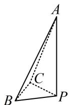
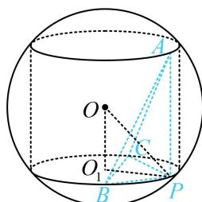

> [!faq]- 《第3节 外接球问题》例题解析
>
> > [!success]- **【答案】** $43 \pi$
>
> > [!note]- **【分析】**
> > 本题未单列分析。
>
> > [!note]- **【解析】**
> > 解析：条件中有 $PA \perp$ 面 $PBC$ , 且 $\triangle PBC$ 不是直角三角形, 如图 1, 这是内容提要第 2 点中①的三棱锥转圆柱模型, 如图 2, 模型的核心方程是 $r^{2} + \left(\frac{h}{2}\right)^{2} = R^{2}$ , 故先求 $r$ , 可用正弦定理求,
> >
> > 设 $\triangle PBC$ 的外接圆半径为 $r$ ， $\cos \angle BPC = \frac{PB^2 + PC^2 - BC^2}{2PB \cdot PC} = -\frac{1}{3} \Rightarrow \sin \angle BPC = \sqrt{1 - \left(-\frac{1}{3}\right)^2} = \frac{2\sqrt{2}}{3}$ ，
> >
> > 由正弦定理， $\frac{BC}{\sin\angle BPC} = \frac{2\sqrt{6}}{\frac{2\sqrt{2}}{3}} = 3\sqrt{3} = 2r$ ，所以 $r = \frac{3\sqrt{3}}{2}$
> >
> > 又 $\frac{h}{2} = OO_{1} = \frac{1}{2} PA = 2$ ，所以 $R = \sqrt{r^2 + \left(\frac{h}{2}\right)^2} = \sqrt{\left(\frac{3\sqrt{3}}{2}\right)^2 + 2^2} = \frac{\sqrt{43}}{2},$
> >
> > 故球 O 表面积 $S = 4\pi R^{2} = 43\pi$ .
> >
> >
> >   
> > 图1
> >
> >   
> > 图2
