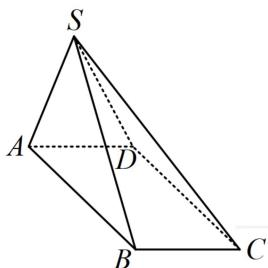
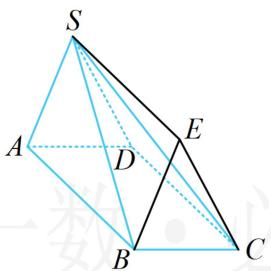
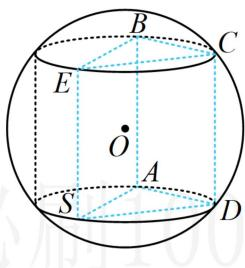
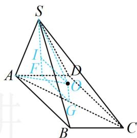

> [!faq]- 《第3节 外接球问题》例题解析
>
> > [!success]- **【答案】** A
>
> > [!note]- **【分析】**
> > 本题未单列分析。
>
> > [!note]- **【解析】**
> > 解法1：涉及四棱锥的外接球，先分析其结构特征，重点看是否有线面垂直，底面ABCD为矩形 $\Rightarrow AB\perp AD$ ，又 $SA\perp AB$ ，所以 $AB\perp$ 平面SAD①，
> >
> > 有线面垂直, 故四棱锥可补全为直三棱柱, 按内容提要第 2 点②的圆柱模型处理,
> >
> > 补形过程如图1，2，3， $\left\{ \begin{array}{ll}SA\bot AB\\ SA = 1\quad \Rightarrow AB = \sqrt{SB^2 - SA^2} = \sqrt{3}\Rightarrow CD = \sqrt{3}\\ SB = 2 \end{array} \right.$
> >
> > 由①可得 $AB \perp SD$ ，又 $CD \parallel AB$ ，所以 $CD \perp SD$ ，故 $SD = \sqrt{SC^2 - CD^2} = 1$ ，结合 $SA = AD = 1$ 可得 $\triangle SAD$ 是边长为 1 的正三角形，其外接圆半径 $r = 1 \times \frac{\sqrt{3}}{2} \times \frac{2}{3} = \frac{\sqrt{3}}{3}$ ，
> >
> > 又 $\frac{h}{2} = \frac{1}{2} AB = \frac{\sqrt{3}}{2}$ ，所以 $R = \sqrt{r^2 + \left(\frac{h}{2}\right)^2} = \sqrt{\frac{1}{3} + \frac{3}{4}} = \sqrt{\frac{13}{12}}$ ，故外接球的表面积 $S = 4\pi R^2 = \frac{13\pi}{3}$ .
> >
> >   
> > 图1
> >
> >   
> > 图2
> >
> >   
> > 图3
> >
> >   
> > 图4
> >
> > 解法2: 分析 $\triangle S A D$ 为正三角形、 $A B \perp$ 平面 $S A D$ 等过程同解法1. 若没想到上述补形的方法, 由于底面矩形的外心好找, 也可用内容提要最后提及的通法来处理,
> >
> > 如图4，设 $G$ 为矩形ABCD的中心，过 $G$ 作平面ABCD的垂线，则球心 $O$ 在该垂线上，
> >
> > 要求外接圆半径，可利用图中 $OS = OA$ 来建立等量关系，
> >
> > 设 $F$ 是 $AD$ 中点， $OI \perp SF$ 于 $I$ ，则 $SF \perp AD$ ，又 $AB \perp$ 面 $SAD$ ，所以 $SF \perp AB$ ，故 $SF \perp$ 面 $ABCD$ ，
> >
> > 所以 $SF \parallel OG$ ，故 $IF = OG$ ，设 $IF = OG = x$ ，则 $IS = SF - IF = \frac{\sqrt{3}}{2} - x$ ， $OI = FG = \frac{1}{2} CD = \frac{\sqrt{3}}{2}$ ，
> >
> > 设 $OS = OA = R$ ，在 $\triangle SOI$ 中， $IS^2 +OI^2 = OS^2$ ，所以 $\left(\frac{\sqrt{3}}{2} -x\right)^2 +\frac{3}{4} = R^2$ ②，
> >
> > 在 $\triangle OAG$ 中， $OG^{2} + AG^{2} = OA^{2}$ ，所以 $x^{2} + 1 = R^{2}$ ③，
> >
> > 联立②③可解得： $R^{2}=\frac{13}{12}$ ，所以外接球的表面积 $S=4\pi R^{2}=\frac{13\pi}{3}$ .
>
> > [!tip]- **【反思】**
> > 圆柱模型的标志性条件是线面垂直，若没有观察出模型，也可考虑通法思路。当涉及面面垂直时，用通法思路常较简单，如本题的面 $SAD \perp$ 面ABCD。（因此时作垂线，垂足在两面交线上，如SF）
