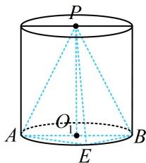
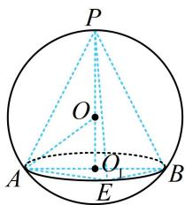

> [!faq]- 《第3节 外接球问题》例题解析
>
> > [!success]- **【答案】** 详见解析
>
> > [!note]- **【分析】**
> > 本题未单列分析。
>
> > [!note]- **【解析】**
> > 解析：如图1，由题意， $AB = 2$ ，所以 $\triangle ABE$ 的外接圆半径 $r = 1$ ，三棱锥 $P - ABE$ 的高为2，可发现 $PA = PB = PE$ ，这是侧棱相等的圆锥模型.把圆锥 $PO_{1}$ 放入球 $O$ ，如图2，再到 $\triangle OO_{1}A$ 中分析，可发现 $PA = PB = PE$ ，这是侧棱相等的圆锥模型. 把圆锥 $PO_{1}$ 设外接球的半径为 $R$ ，则 $OA = OP = R$ ， $OO_{1} = PO_{1} - OP = 2 - R$ ， $O_{1}A = 1$ ，因为 $OO_{1}^{2} + O_{1}A^{2} = OA^{2}$ ，所以 $(2 - R)^{2} + 1 = R^{2}$ ，解得： $R = \frac{5}{4}$ 故外接球的表面积 $S = 4\pi R^{2} = \frac{25\pi}{4}$ . 答案： $\frac{25\pi}{4}$
> >
> > 
> >
> >   
> > 图1  
> > 图2
