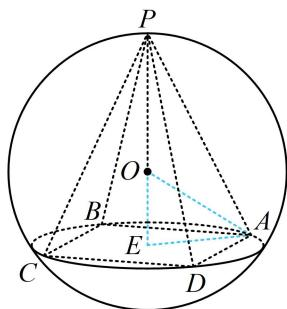

> [!faq]- 《第3节 外接球问题》例题解析
>
> > [!success]- **【答案】** C
>
> > [!note]- **【分析】**
> > 本题未单列分析。
>
> > [!note]- **【解析】**
> > 解析：设球的半径为 $R$ ，由题意， $\frac{4}{3}\pi R^3 = 36\pi$ ，所以 $R = 3$ ①，
> >
> > 正四棱锥的侧棱相等，可按圆锥模型处理，先列两个核心方程，
> > 如图，设 PE = h ，底面外接圆半径为 r，则 $\left\{\begin{aligned}(h-R)^{2}+r^{2}&=R^{2}\\h^{2}+r^{2}&=l^{2}\end{aligned}\right.$ ，将①代入可得 $\left\{\begin{aligned}(h-3)^{2}+r^{2}&=9\\h^{2}+r^{2}&=l^{2}\end{aligned}\right.$ ②，
> > 题干给了 l 的范围，所以消去 r 和 h，都用 l 表示，
> > 由②可得 $h=\frac{l^{2}}{6}$ ， $r^{2}=l^{2}-\frac{l^{4}}{36}$ ，所以正方形 ABCD 的面积 $S_{ABCD}=\frac{1}{2}\times(2r)^{2}=2r^{2}=2\left(l^{2}-\frac{l^{4}}{36}\right)$
> >
> > 故四棱锥 $P - ABCD$ 的体积 $V = \frac{1}{3} \times 2\left(l^2 - \frac{l^4}{36}\right) \times \frac{l^2}{6} = \frac{2}{3} \times \left(l^2 - \frac{l^4}{36}\right) \times \frac{l^2}{6}$ ,
> >
> > $$
> > \frac {l ^ {2}}{6}
> > $$
> >
> > 设 $t = \frac{l^2}{6}$ ，则 $V = \frac{2}{3} (6t - t^2)t = \frac{2}{3} (6t^2 - t^3)$ ，因为 $3 \leq l \leq 3\sqrt{3}$ ，所以 $\frac{3}{2} \leq t \leq \frac{9}{2}$ ，
> >
> > 
> >
> > $$
> > f (t) = \frac {2}{3} (6 t ^ {2} - t ^ {3})
> > $$
> >
> > $$
> > \frac {3}{2} \leq t \leq \frac {9}{2}
> > $$
> >
> > $$
> > f ^ {\prime} (t) = \frac {2}{3} (1 2 t - 3 t ^ {2}) = 2 t (4 - t)
> > $$
> >
> > 所以 $f^{\prime}(t) > 0\Leftrightarrow \frac{3}{2}\leq t < 4$ ， $f^{\prime}(t) < 0\Leftrightarrow 4 <   t\leq \frac{9}{2}$ ，从而 $f(t)$ 在 $\left[\frac{3}{2},4\right)$ 上 $\nearrow$ ，在 $\left(4,\frac{9}{2}\right]$ 上 $\searrow$ 故 $f(t)_{\mathrm{max}} = f
>
> > [!tip]- **【反思】**
> > 侧棱相等的棱锥都可以按圆锥模型处理，列出核心方程求解；正棱锥的所有侧棱都相等.
