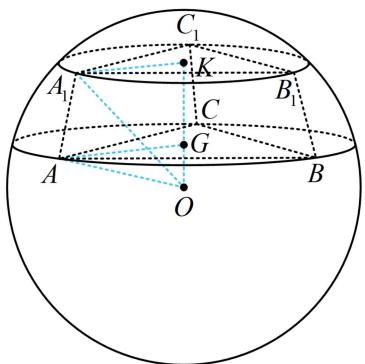
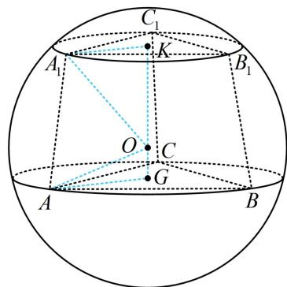

> [!faq]- 《第3节 外接球问题》例题解析
>
> > [!success]- **【答案】** A
>
> > [!note]- **【分析】**
> > 本题未单列分析。
>
> > [!note]- **【解析】**
> > A. $100 \pi$ B. $128 \pi$ C. $144 \pi$ D. $192 \pi$
> >
> > 解析：棱台的上、下底面半径分别为 $KA_{1} = 3\sqrt{3}\times \frac{\sqrt{3}}{2}\times \frac{2}{3} = 3$ ， $GA = 4\sqrt{3}\times \frac{\sqrt{3}}{2}\times \frac{2}{3} = 4$ ，高 $KG = 1$
> >
> > $$
> > O K - O G = \sqrt {O A _ {1} ^ {2} - K A _ {1} ^ {2}} - \sqrt {O A ^ {2} - A G ^ {2}} = \sqrt {R ^ {2} - 9} - \sqrt {R ^ {2} - 1 6} = 1
> > $$
> >
> > 所以 $\sqrt{R^2 - 9} = \sqrt{R^2 - 16} + 1$ ，同时平方可得 $R^2 - 9 = R^2 - 16 + 2\sqrt{R^2 - 16} + 1$
> >
> > 化简得： $\sqrt{R^2 - 16} = 3$ ，解得： $R = 5$ ，所以球 $O$ 的表面积 $S = 4\pi R^2 = 100\pi$ ，故选A；
> >
> > $$
> > A A _ {1} K G
> > $$
> >
> > 若为图2，则 $OA_{1} = \sqrt{A_{1}K^{2} + OK^{2}} = \sqrt{9 + OK^{2}}\leq \sqrt{9 + KG^{2}} = \sqrt{10}$
> >
> > 而 $OA = \sqrt{AG^2 + OG^2} = \sqrt{16 + OG^2} \geq 4$ ，所以 $OA > OA_1$ ，与 $OA = OA_1$ 矛盾，故不可能是图2的情形。
> >
> >
> >   
> > 图1
> >
> >   
> > 图2
>
> > [!tip]- **【反思】**
> > 设圆台的上、下底面半径分别为 $r_1$ ， $r_2$ ，高为 $h$ ，当 $r_1^2 + h^2 = r_2^2$ 时，外接球球心恰为下底面圆心；当 $r_1^2 + h^2 < r_2^2$ 时，球心在台体外；当 $r_1^2 + h^2 > r_2^2$ 时，球心在台体内。本题即为 $r_1^2 + h^2 < r_2^2$ 的情形。
