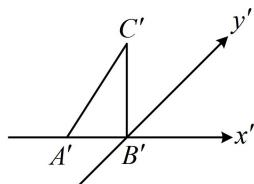

<!-- question-source:start -->
1. (★★) (多选)

如图， $\triangle A'B'C'$ 表示水平放置的 $\triangle ABC$ 根据斜二测画法得到的直观图， $A'B'$ 在 $x'$ 轴上， $B'C'$ 与 $x'$ 轴垂直，且 $B'C' = \sqrt{2}$ ，则下列说法正确的是（）  
A. $\triangle ABC$ 的边 $AB$ 上的高为 2  
B. $\triangle ABC$ 的边 $AB$ 上的高为 4  
C. $AC > BC$ D. $AC < BC$

<!-- question-source:end -->

![[Q00050724A1]]
