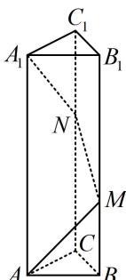

<!-- question-source:start -->
2. (2022·安徽定远模拟·★★)

如图，正三棱柱 $ABC - A_{1}B_{1}C_{1}$ 中， $AA_{1} = 4$ ， $AB = 1$ ，一只蚂蚁从点 $A$ 出发，沿每个侧面爬到 $A_{1}$ ，路线为 $A \rightarrow M \rightarrow N \rightarrow A_{1}$ ，则蚂蚁爬行的最短路程是（）

A. 4 B. 5 C. 6 D. $2\sqrt{5} + 1$

<!-- question-source:end -->

![[Q00050725A1]]
