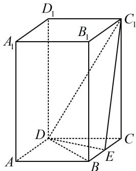

<!-- question-source:start -->
## 4. (★★★)

如图，直四棱柱 $ABCD - A_{1}B_{1}C_{1}D_{1}$ 的底面是菱形， $AA_{1} = 4$ ， $AB = 2$ ， $\angle BAD = 60^{\circ}$ ， $E$ 是 $BC$ 的中点，则点 $C$ 到平面 $C_{1}DE$ 的距离为 \_\_\_\_.

## 一数·必刷100讲
<!-- question-source:end -->

![[Q00050727A1]]
