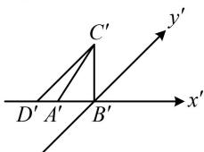
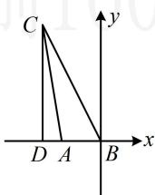

> [!faq]- 《第4节 立体几何常见方法综合》参考答案
>
> > [!success]- **【答案】** BD
>
> > [!note]- **【分析】**
> > 本题未单列分析。
>
> > [!note]- **【解析】**
> > BD
> >
> > 解析：要求 $\triangle ABC$ 的边 $AB$ 上的高，可先把直观图中与高对应的线段画出来，需注意原图中与 $AB$ 垂直的线段在直观图中应与 $A'B'$ 成 $45^{\circ}$ 角，如图1，过 $C'$ 作 $y'$ 轴的平行线交 $x'$ 轴于 $D'$ ，则原图中 $CD \parallel y$ 轴，如图2，所以 $CD$ 即为 $AB$ 边上的高，在图1中， $\triangle B'C'D'$ 为等腰直角三角形，且 $B'C' = \sqrt{2}$ ，所以 $C'D' = 2$ ，故在图2中， $CD = 4$ ，所以 $\triangle ABC$ 的边 $AB$ 上的高为4，故A项错误，B项正确；由图2可知 $AC < BC$ ，故C项错误，D项正确.
> >
> >   
> > 图1
> >
> >   
> > 图2
