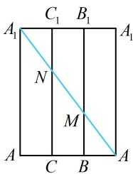

> [!faq]- 《第4节 立体几何常见方法综合》参考答案
>
> > [!success]- **【答案】** B
>
> > [!note]- **【分析】**
> > 本题未单列分析。
>
> > [!note]- **【解析】**
> > B
> >
> > 解析：涉及最短路径问题，把空间图形展开到平面上来看，
> >
> > 如图是正三棱柱沿 $AA_{1}$ 的侧面展开图，
> >
> > 最短路径即为图中蓝色线段，其长度为 $\sqrt{3^2 + 4^2} = 5$ 。
> >
> > 
