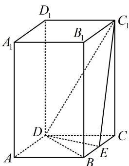

> [!faq]- 《第4节 立体几何常见方法综合》参考答案
>
> > [!success]- **【答案】** $\frac{4\sqrt{17}}{17}$ 
>
> > [!note]- **【分析】**
> > 本题未单列分析。
>
> > [!note]- **【解析】**
> > 解析：直接求距离需作垂线，较麻烦，注意到 $V_{C_1 - CDE}$ 和 $S_{\triangle C_1DE}$ 好求，故用等体积法，
> >
> > 因为 ABCD 为菱形，所以 BC = CD ，又 $\angle BAD = 60^{\circ}$
> >
> > 所以 $\angle BCD = 60^{\circ}$ ，故 $\triangle BCD$ 为正三角形，
> >
> > 因为 AB = 2 ，所以 $DE = \sqrt{3}$ ，
> >
> > 又 $C_1C = AA_1 = 4$ ，所以 $C_1D = \sqrt{CD^2 + CC_1^2} = 2\sqrt{5}$
> >
> > 因为 CE=1，所以 $C_{1}E=\sqrt{CE^{2}+CC_{1}^{2}}=\sqrt{17}$ ，
> >
> > 从而 $DE^{2} + C_{1}E^{2} = 20 = C_{1}D^{2}$ ，故 $DE\perp EC_{1}$
> >
> > 所以 $S_{\triangle C_1DE} = \frac{1}{2}\times \sqrt{3}\times \sqrt{17} = \frac{\sqrt{51}}{2},$
> >
> > 设点 C 到平面 $C_{1}DE$ 的距离为 d，
> >
> > 则 $V_{C - C_1DE} = \frac{1}{3}\times \frac{\sqrt{51}}{2} d = \frac{\sqrt{51}}{6} d$ ，另一方面， $V_{C - C_1DE} =$
> >
> > $$
> > V _ {C _ {1} - C D E} = \frac {1}{3} S _ {\triangle C D E} \cdot C C _ {1} = \frac {1}{3} \times \frac {1}{2} \times 1 \times \sqrt {3} \times 4 = \frac {2 \sqrt {3}}{3}
> > $$
> >
> > 所以 $\frac{\sqrt{51}}{6} d = \frac{2\sqrt{3}}{3}$ ，解得： $d = \frac{4\sqrt{17}}{17}$
> >
> > 故点 $C$ 到平面 $C_1DE$ 的距离为 $\frac{4\sqrt{17}}{17}$
