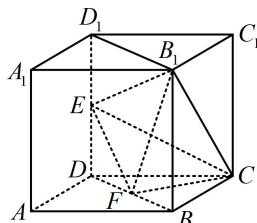

> [!faq]- 《第4节 立体几何常见方法综合》参考答案
>
> > [!success]- **【答案】** 1
>
> > [!note]- **【分析】**
> > 本题未单列分析。
>
> > [!note]- **【解析】**
> > 解析：如图，以 $B_{1}$ 为顶点求体积，则高不好找，故尝试转换顶点，观察发现 $CF \perp$ 面 $B_{1}EF$ ，故选 $C$ 为顶点，
> >
> > 因为 $CB = CD$ ， $F$ 为 $DB$ 中点，所以 $CF \perp DB$ ，又 $BB_{1} \perp$
> >
> > 平面 $ABCD$ ，所以 $CF \perp BB_{1}$ ，故 $CF \perp$ 平面 $BB_{1}D_{1}D$ ，
> >
> > 所以 $V_{B_{1}-CEF}=V_{C-B_{1}EF}=\frac{1}{3}S_{\triangle B_{1}EF}\cdot CF$ ①,
> >
> > 又 $S_{\triangle B_1EF} = S_{BB_1D_1D} - S_{\triangle B_1D_1E} - S_{\triangle DEF} - S_{\triangle BB_1F}$
> >
> > $$
> > = 2 \times 2 \sqrt {2} - \frac {1}{2} \times 2 \sqrt {2} \times 1 - \frac {1}{2} \times 1 \times \sqrt {2} - \frac {1}{2} \times \sqrt {2} \times 2 = \frac {3 \sqrt {2}}{2},
> > $$
> >
> > $CF=\frac{1}{2}BD=\sqrt{2}$ ，代入①得 $V_{B_{1}-CEF}=\frac{1}{3}\times\frac{3\sqrt{2}}{2}\times\sqrt{2}=1$ .
> >
> > 
