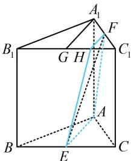

> [!faq]- 《第4节 立体几何常见方法综合》参考答案
>
> > [!success]- **【答案】** $17: 7$
>
> > [!note]- **【分析】**
> > 本题未单列分析。
>
> > [!note]- **【解析】**
> > 解析：如图， $F$ 和 $AE$ 分别在上、下两个面内，且过 $F$ 在面 $A, B, C_{1}$ 内易作 $AE$ 的平行线，故作平行线扩大截面，
> >
> > 取 $B_{1}C_{1}$ 中点 $G$ ， $C_1G$ 中点 $H$ ，连接 $A_{1}G$ ，FH，EH，
> >
> > 则 $FH \parallel A_{1}G \parallel AE$ ，所以截面即为 $AEHF$ 此截面右侧部分为三棱台，可先求它的体积，此截面右侧部分为三棱台，可先求它的体积，
> > 由题意， $S_{\triangle ABC}=\frac{1}{2}\times1\times1\times\frac{\sqrt{3}}{2}=\frac{\sqrt{3}}{4}$ ， $S_{\triangle AEC}=\frac{1}{2}S_{\triangle ABC}=\frac{\sqrt{3}}{8}$ ， $S_{\triangle C_{1}FH}=\frac{1}{4}S_{\triangle A_{1}GC_{1}}=\frac{1}{4}S_{\triangle AEC}=\frac{\sqrt{3}}{32}$ 所以截面右侧部分三棱台的体积 $V_{1}=\frac{1}{3}\times\left(\frac{\sqrt{3}}{8}+\frac{\sqrt{3}}{32}+\sqrt{\frac{\sqrt{3}}{8}\cdot\frac{\sqrt{3}}{32}}\right)\times1=\frac{7\sqrt{3}}{96}$ 又三棱柱 $ABC-A_{1}B_{1}C_{1}$ 的体积 $V=\frac{\sqrt{3}}{4}\times1=\frac{\sqrt{3}}{4}$ 所以截面左侧的体积为 $V_{2}=\frac{\sqrt{3}}{4}-\frac{7\sqrt{3}}{96}=\frac{17\sqrt{3}}{96}$ 故所求体积之比为17:7.
> >
> > 
