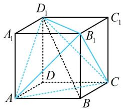
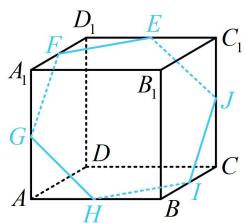
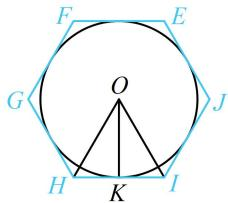

> [!faq]- 《第4节 立体几何常见方法综合》参考答案
>
> > [!success]- **【答案】** ABD
>
> > [!note]- **【分析】**
> > 本题未单列分析。
>
> > [!note]- **【解析】**
> > ABD
> >
> > 解析：A项，因为正方体的内切球直径为 $1\mathrm{m}$ ，所以直径为 $0.99\mathrm{m}$ 的球体可以放入正方体容器，故A项正确；B项，我们想让正四面体尽可能大，联想正方体内特殊的正四面体，进而想到由面对角线可构成正四面体，如图1，蓝色正四面体的棱长为 $\sqrt{2}$ ，比1.4大，从而所有棱长均为 $1.4\mathrm{m}$ 的正四面体可以放入正方体容器，故B项正确；C项，注意到圆柱的底面直径很小，圆柱很细长，不妨将其近似成线段，故先看 $1.8\mathrm{m}$ 的线段能否放入正方体，如图1，正方体的棱长为1，则正方体表面上任意两点之间距离的最大值为 $BD_{1} = \sqrt{3} < 1.8$ ，所以高为 $1.8\mathrm{m}$ 的圆柱不可能放入该正方体，故C项错误；D项，注意到圆柱的高很小，不妨将圆柱近似看成圆，故先分析直径为 $1.2\mathrm{m}$ 的圆能否放入正方体，为了研究这一问题，我们得先找正方体的尽可能大的截面，正方体有一个非常特殊的截面，我们不妨来看看，如图2，E，F，G，H，I，J分别为所在棱的中点，则EFGHIJ是边长为 $\frac{\sqrt{2}}{2}$ 的正六边形，其内切圆如图3，其中K为HI中点，则内切圆半径 $r = OK = \frac{\sqrt{2}}{2} \times \frac{\sqrt{3}}{2} = \frac{\sqrt{6}}{4}$ ，直径 $2r = \frac{\sqrt{6}}{2} > 1.2$ 所以可以想象，底面直径为 $1.2\mathrm{m}$ ，高为 $0.01\mathrm{m}$ 的圆柱体能放进正方体容器，故D项正确。
> >
> >   
> > 图1
> >
> >   
> > 图2
> >
> >   
> > 图3
>
> > [!tip]- **【反思】**
> > 本题不同于常规考法，无需准确计算，更多的是考大家的经验。事实上，B项提及的正四面体（图1）就是正方体内最大的正四面体了。因为该正四面体和正方体有相同的外接球，若正四面体再大一点，就会超出该外接球，必然也会超出正方体的范围。D项提及的截面（图2）也是正方体面积最大、内切圆半径最大的截面，但要严格论证这一结论，需要大量篇幅，此处略去。
> >
> > 一数·必刷100讲
