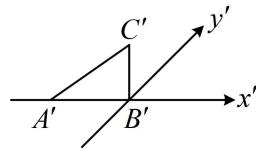

<!-- question-source:start -->
【例1】（多选）用斜二测画法画水平放置的平面图形的直观图时，下述结论正确的是（）
A. 梯形的直观图仍旧是梯形
B. 若 $\triangle ABC$ 的直观图是边长为2的等边三角形，那么 $\triangle ABC$ 的面积为 $\sqrt{6}$ C. $\triangle ABC$ 的直观图如图所示， $A'B'$ 在 $x'$ 轴上， $A'B'=2$ ， $B'C'$ 与 $x'$ 轴垂直，且 $B'C'=\sqrt{2}$ ，则 $\triangle ABC$ 的面积为4
D. 菱形的直观图可以是矩形

<!-- question-source:end -->

![[高中/总复习/教辅/一数常规版2026/第9章 立体几何、空间向量/模块1 立体图形的结构探究/第4节 立体几何常见方法综合/类型01_斜二测画法/例题/answers/Q00050552A1.md]]
