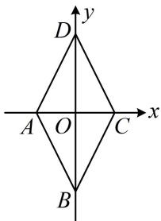
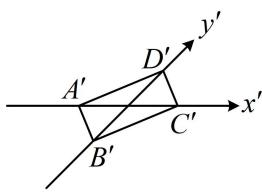

> [!faq]- 《第4节 立体几何常见方法综合》例题解析
>
> > [!success]- **【答案】** ACD
>
> > [!note]- **【分析】**
> > 本题未单列分析。
>
> > [!note]- **【解析】**
> > A. 梯形的直观图仍旧是梯形
> > B. 若 $\triangle ABC$ 的直观图是边长为2的等边三角形，那么 $\triangle ABC$ 的面积为 $\sqrt{6}$ C. $\triangle ABC$ 的直观图如图所示， $A'B'$ 在 $x'$ 轴上， $A'B'=2$ ， $B'C'$ 与 $x'$ 轴垂直，且 $B'C'=\sqrt{2}$ ，则 $\triangle ABC$ 的面积为4
> > D. 菱形的直观图可以是矩形
> >
> > 
> >
> > 解析：A项，斜二测画法不改变平行关系，也不改变平行线段的长度大小关系，所以梯形的直观图仍旧是梯形，故A项正确；
> >
> > B项，原图与直观图的面积关系为 $S=2\sqrt{2}S'$ ，直观图的面积 $S'$ 容易求得，故可由此求得原图面积S，
> >
> > 直观图是边长为2的等边三角形 $\Rightarrow S' = \frac{1}{2} \times 2 \times 2 \times \frac{\sqrt{3}}{2} = \sqrt{3} \Rightarrow S = 2\sqrt{2} S' = 2\sqrt{6}$ ，故B项错误；
> >
> > C 项， $S_{\triangle A'B'C'} = \frac{1}{2} \times 2 \times \sqrt{2} = \sqrt{2} \Rightarrow S_{\triangle ABC} = 2\sqrt{2} \times \sqrt{2} = 4$ ，故 C 项正确；
> >
> > D 项，如图 1，菱形 ABCD 满足 AC = 2，BD = 4，
> >
> > 那么在图2中， $A^{\prime}C^{\prime}=B^{\prime}D^{\prime}=2$ ，
> >
> > 所以 $A^{\prime}B^{\prime}C^{\prime}D^{\prime}$ 为矩形，故 D 项正确.
> >
> >
> >   
> > 图1
> >
> >   
> > 图2
