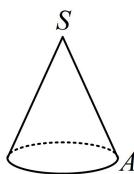
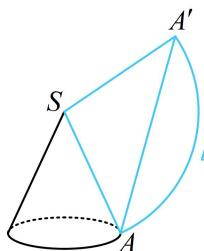

> [!faq]- 《第4节 立体几何常见方法综合》例题解析
>
> > [!success]- **【答案】** A
>
> > [!note]- **【分析】**
> > 本题未单列分析。
>
> > [!note]- **【解析】**
> > A. 1 B. 2 C. $\sqrt{2}$ D. $\sqrt{3}$
> >
> > 
> >
> > 解析：要分析最短距离，直接从圆锥上看不易，可把圆锥侧面展开，到平面上来看，
> >
> > 如图为圆锥的侧面展开图，题干的最短距离即为在扇形内，从 A 到 $A'$ 的最短距离，显然沿直线最短，所以 $AA' = 3\sqrt{3}$ ，又 $SA = SA' = 3$ ，所以 $\cos \angle ASA' = \frac{SA^{2} + SA'^{2} - AA'^{2}}{2SA \cdot SA'} = -\frac{1}{2}$ ，从而 $\angle ASA' = \frac{2\pi}{3}$ ，故扇形的圆弧长 $l = \frac{2\pi}{3} \times 3 = 2\pi$ ，又 $l = 2\pi r$ ，其中 r 为底面半径，所以 $2\pi r = 2\pi$ ，解得：r = 1。答案：A
> >
> > 
>
> > [!tip]- **【反思】**
> > 不管什么空间图形，涉及最短距离问题，一般都把空间图形展开为平面图形，到平面上来分析.
