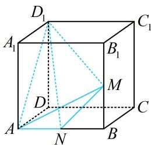

> [!faq]- 《第4节 立体几何常见方法综合》例题解析
>
> > [!success]- **【答案】** 详见解析
>
> > [!note]- **【分析】**
> > 本题未单列分析。
>
> > [!note]- **【解析】**
> > 解析：如图，以 $A$ 为顶点求体积，高不好找，但若转换成以 $D_{1}$ 为顶点，则高即为 $A_{1}D_{1}$ ，底面积也好算，由题意， $V_{A - NMD_1} = V_{D_1 - AMN} = \frac{1}{3} S_{\triangle AMN} \cdot A_1D_1 = \frac{1}{3} \times \frac{1}{2} \times 1 \times 1 \times 2 = \frac{1}{3}$ . 答案： $\frac{1}{3}$
> >
> > 
