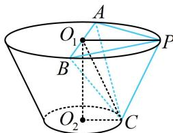

> [!faq]- 《第4节 立体几何常见方法综合》例题解析
>
> > [!success]- **【答案】** D
>
> > [!note]- **【分析】**
> > 本题未单列分析。
>
> > [!note]- **【解析】**
> > 解析：如图，直接算距离需作垂线，较麻烦，但观察发现 $V_{C - PAB}$ 和 $S_{\triangle ABC}$ 好求，故用等体积法， $\left\{ \begin{array}{l}AP = BP\\ AB\text{为直径} \end{array} \right.\Rightarrow \triangle PAB$ 是等腰 Rt 三角形，又 $AB = 8$ ，所以 $PA = PB = 4\sqrt{2}$ ， $S_{\triangle PAB} = \frac{1}{2}\times (4\sqrt{2})^2 = 16$ 点 $C$ 到平面 $PAB$ 的距离等于棱台的高 $h$ ，所以 $V_{C - PAB} = \frac{1}{3}\times 16\times 4 = \frac{64}{3}$
> >
> > 接下来求距离，也即三棱锥 $P - ABC$ 的以 $\triangle ABC$ 为底面的高，还差 $S_{\triangle ABC}$ ，故再算它，
> >
> > 由图可知 $O_{1}C = \sqrt{O_{1}O_{2}^{2} + O_{2}C^{2}} = \sqrt{4^{2} + 2^{2}} = 2\sqrt{5}$ ，且由对称性可知 $AC = BC$
> >
> > 所以 $O_{1}C \perp AB$ ，故 $S_{\triangle ABC} = \frac{1}{2} AB \cdot O_{1}C = \frac{1}{2} \times 8 \times 2\sqrt{5} = 8\sqrt{5}$ ，
> >
> > 设点 $P$ 到平面 $ABC$ 的距离为 $d$ ，则 $V_{P - ABC} = \frac{1}{3} S_{\triangle ABC} \cdot d = \frac{8\sqrt{5}}{3} d$ ，因为 $V_{P - ABC} = V_{C - PAB}$ ，所以 $\frac{8\sqrt{5}}{3} d = \frac{64}{3}$ ，解得： $d = \frac{8\sqrt{5}}{5}$ .
> >
> > 
>
> > [!tip]- **【总结】**
> > 等体积法除了用于把难求的体积转化为好求的体积计算之外，还可用于求点到平面的距离.
