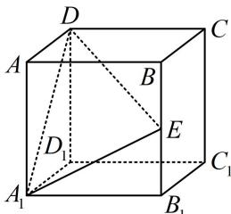

<!-- question-source:start -->
【例 4】如图，在棱长为 2 的正方体 $ABCD-A_{1}B_{1}C_{1}D_{1}$ 中，E 是棱 $BB_{1}$ 的中点，则正方体过 $A_{1}$ ，D，E 三点的截面的面积为 \_\_\_\_.

<!-- question-source:end -->

![[高中/总复习/教辅/一数常规版2026/第9章 立体几何、空间向量/模块1 立体图形的结构探究/第4节 立体几何常见方法综合/类型04_多面体的截面问题/例题/answers/Q00050556A1.md]]
