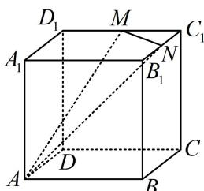

<!-- question-source:start -->
【例 5】如图, 正方体 $ABCD-A_{1}B_{1}C_{1}D_{1}$ 的棱长为 1 , $M$ , $N$ 分别为 $C_{1}D_{1}$ 和 $B_{1}C_{1}$ 的中点, 用过 $A$ , $M$ , $N$ 的平面去截正方体, 则所得截面图形的周长为 \_\_\_\_.

<!-- question-source:end -->

![[高中/总复习/教辅/一数常规版2026/第9章 立体几何、空间向量/模块1 立体图形的结构探究/第4节 立体几何常见方法综合/类型04_多面体的截面问题/例题/answers/Q00050557A1.md]]
