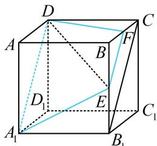
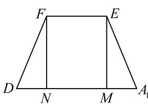

> [!faq]- 《第4节 立体几何常见方法综合》例题解析
>
> > [!success]- **【答案】** $\frac{9}{2}$
>
> > [!note]- **【分析】**
> > 本题未单列分析。
>
> > [!note]- **【解析】**
> > 解析：$\triangle ADE$ 的边 $DE$ 在正方体内部，截面不完整，需将其扩大，观察发现 $AD$ 和
> >
> > $E$ 分别位于左、右两个面内，且过 $E$ 在面 $BB_{1}C_{1}C$ 内易作 $A_{1}D$ 的平行线，故直接作平行线即可扩大截面，如图1，取 $BC$ 中点 $F$ ，连接 $DF$ ， $EF$ ，则 $EF//B_{1}C//A_{1}D$ ，所以截面为 $A_{1}DFE$ ，
> >
> > 正方体棱长为 $2 \Rightarrow A_{1}D = 2\sqrt{2}$ ， $EF = \sqrt{2}$ ， $DF = \sqrt{CD^{2} + CF^{2}} = \sqrt{5}$ ， $A_{1}E = \sqrt{A_{1}B_{1}^{2} + B_{1}E^{2}} = \sqrt{5}$
> >
> > 把截面单独画出来如图2，作 $EM \perp A_{1}D$ 于M，
> >
> > $FN \perp A_{1}D$ 于 $N$ ，则 $MN = EF = \sqrt{2}$ ， $A_{1}M = DN = \frac{\sqrt{2}}{2}$ ，所以 $FN = \sqrt{DF^2 - DN^2} = \frac{3}{\sqrt{2}}$ ，故 $S_{A_1DFE} = \frac{1}{2} \times (\sqrt{2} + 2\sqrt{2}) \times \frac{3}{\sqrt{2}} = \frac{9}{2}$ .
> >
> > 
> >
> > 
> >
> >
> > 图1
> >
> > 图2
>
> > [!tip]- **【反思】**
> > 直接在表面上作对侧直线的平行线是最常见的扩大截面的方法，我们称之为“平行线法”.
