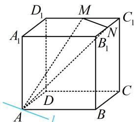
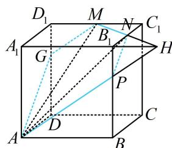
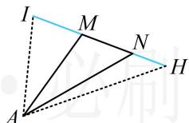

> [!faq]- 《第4节 立体几何常见方法综合》例题解析
>
> > [!success]- **【答案】** $\frac{\sqrt{2}}{2} +\sqrt{13}$
>
> > [!note]- **【分析】**
> > 本题未单列分析。
>
> > [!note]- **【解析】**
> > 解析：直线 $MN$ 和点 $A$ 分别在上、下两个平行的面内, 但若过 $A$ 作 $MN$ 的平行线 $l$ , 则 $l$ 在正方体外, 如图 1, 不像例 4 那么好处理了, 怎么办呢? 此时可用 “延长线法”, 我们一般通过延长表面的线, 找它与棱的交点, 从而扩大截面. 可以发现 $\triangle AMN$ 中的 $MN$ 在表面, 所以延长它,
> >
> > 如图2，延长 $MN$ 和 $A_{1}B_{1}$ 交于点 $H$ ，则 $H$ 是平面 $AMN$ 与平面 $ABB_{1}A_{1}$ 的一个公共点，此时“小面” $AMN$ 就扩大为了“大面” $AMH$ . 连接 $AH$ 交 $BB_{1}$ 于 $P$ ，连接 $NP$ ，则 $AP$ ， $NP$ 都是截面的边界线，在做下一步之前，需先分析 $P$ 在 $BB_{1}$ 上的位置，先看 $H$ 的位置，
> >
> > 因为 $N$ 是 $B_{1}C_{1}$ 中点，所以 $NB_{1} = NC_{1}$ ，结合 $\left\{ \begin{array}{l} \angle MC_{1}N = \angle HB_{1}N = 90^{\circ} \\ \angle C_{1}NM = \angle B_{1}NH \end{array} \right.$ 可得 $\triangle MNC_{1} \cong \triangle HNB_{1}$ ，
> >
> > 所以 $B_{1}H = MC_{1} = \frac{1}{2} AB$ ，又 $\triangle B_{1}PH\sim \triangle BPA$ ，所以 $\frac{B_1P}{PB} = \frac{B_1H}{AB} = \frac{1}{2}$
> >
> > 再找截面与正方体剩余面的交线，注意到此时过 M 在面 $CDD_{1}C_{1}$ 内易作直线 AP 的平行线，故无需再用上面找点 P 的方法来扩大截面，直接作平行线即可，
> >
> > 作 $MG \parallel AP$ 交 $DD_{1}$ 于 $G$ ，可以发现 $\triangle D_{1}GM \sim \triangle BPA$ ，所以 $\frac{D_{1}G}{BP} = \frac{D_{1}M}{AB} = \frac{1}{2}$ ，
> >
> > 故 $G$ 是靠近 $D_{1}$ 的三等分点，连接 $AG$ ，完整的截面即为五边形AGMNP，
> >
> > 可求得 $AG = \sqrt{AD^2 + DG^2} = \frac{\sqrt{13}}{3}$ ， $GM = \sqrt{D_1G^2 + D_1M^2} = \frac{\sqrt{13}}{6}$ ， $MN = \frac{\sqrt{2}}{2}$
> >
> > $$
> > N P = \sqrt {B _ {1} N ^ {2} + B _ {1} P ^ {2}} = \frac {\sqrt {1 3}}{6}, \quad P A = \sqrt {A B ^ {2} + B P ^ {2}} = \frac {\sqrt {1 3}}{3},
> > $$
> >
> > 故所求截面周长为 $AG + GM + MN + NP + PA = \frac{\sqrt{2}}{2} +\sqrt{13}$
> >
> >
> > 
> >
> > 
>
> > [!tip]- **【反思】**
> > 当直接作平行线得到的直线在多面体外时，可通过延长表面的线，找它与棱的交点来扩大截面。如图，以求过 $A$ ，
> >
> > 图1
> >
> > 图2
> >
> > M, N 三点的截面为例, 只需延长 MN, 找到它与棱所在直线的交点 H, I, 截面就由 AMN 扩大为了 AHI, 再看面 AHI 与其它棱的交点. 当然, 有时只需找到 H, I 中的一个, 就能用平行线法扩大截面了.
> >
> > 
