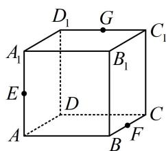
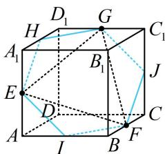

> [!faq]- 《第4节 立体几何常见方法综合》例题解析
>
> > [!success]- **【答案】** $\frac{3\sqrt{3}}{4}$
>
> > [!note]- **【分析】**
> > 本题未单列分析。
>
> > [!note]- **【解析】**
> > 解析：连接 GE, EF, FG, $\triangle GEF$ 三边都不在表面，上面的两种方法都不好做，怎么办？注意到 G, E, F 都是中点，故通过直观想象可猜测截面与 $A_{1}D_{1}$ ，AB, $CC_{1}$ 的交点也是中点，故先取中点来看看，
> >
> > 
> >
> > 设 $H, I, J$ 分别为 $A_{1}D_{1}, AB, CC_{1}$ 的中点，则由图可知截面是正六边形，其边长为 $\frac{\sqrt{2}}{2}$ ，故截面面积 $S = 6 \times \frac{1}{2} \times \frac{\sqrt{2}}{2} \times \frac{\sqrt{2}}{2} \times \frac{\sqrt{3}}{2} = \frac{3\sqrt{3}}{4}$ .
> >
> >
> > 
>
> > [!tip]- **【反思】**
> > 上述截面是正方体的一个特殊截面，它与正方体所有棱所成的角都相等，可把它记住.
