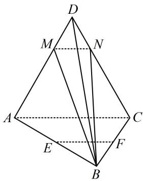

<!-- question-source:start -->
1. (2024·江苏南京模拟（节选）·★★)

如图，在四面体 $ABCD$ 中， $\triangle ACD$ 是边长为3的正三角形， $\triangle ABC$ 是以 $AB$ 为斜边的等腰直角三角形， $E$ ， $F$ 分别为线段 $AB$ ， $BC$ 的中点， $\overrightarrow{AM} = 2\overrightarrow{MD}$ ， $\overrightarrow{CN} = 2\overrightarrow{ND}$ ，求证： $EF//$ 平面 $MNB$ .

## 一数·必刷100讲
<!-- question-source:end -->

![[Q00050575A1]]
