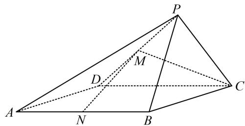

<!-- question-source:start -->
2. (2024·广东广州一模（节选）·★★)

如图, 在四棱锥 $P - ABCD$ 中, 底面 $ABCD$ 是边长为 2 的菱形, $\triangle DCP$ 是等边三角形, $\angle DCB = \angle PCB = \frac{\pi}{4}$ , 点 $M$ , $N$ 分别为 $DP$ 和 $AB$ 的中点, 求证: $MN//$ 平面 $PBC$ .

<!-- question-source:end -->

![[Q00050576A1]]
