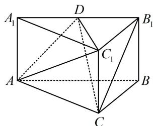

<!-- question-source:start -->
3. (2024·广东模拟（节选）·★★)

如图，在直三棱柱 $ABC - A_{1}B_{1}C_{1}$ 中， $D$ 为 $A_{1}B_{1}$ 的中点，证明： $B_{1}C // \text{平面 } AC_{1}D$ .

<!-- question-source:end -->

![[Q00050577A1]]
