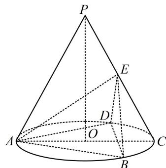

<!-- question-source:start -->
4.（2023·山东潍坊三模（节选）·★★☆）

如图， $P$ 为圆锥的顶点， $O$ 是圆锥底面的圆心， $AC$ 为底面直径， $\triangle ABD$ 为底面圆 $O$ 的内接正三角形，且边长为 $\sqrt{3}$ ，点 $E$ 在母线 $PC$ 上，且 $AE = \sqrt{3}$ ， $CE = 1$ ，求证：直线 $PO \parallel$ 平面 $BDE$ .

一数·必刷100讲

<!-- question-source:end -->

![[Q00050578A1]]
