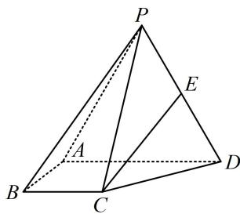

<!-- question-source:start -->
5.（2023·广东六校联考（节选）·★★☆）

如图, 在四棱锥 $P - ABCD$ 中, 侧面 $\triangle PAD$ 是正三角形, 且与底面 $ABCD$ 垂直, $BC \parallel$ 平面 $PAD$ , $BC = \frac{1}{2} AD = 1$ , $E$ 是棱 $PD$ 上的动点, 当 $E$ 是棱 $PD$ 的中点时, 求证: $CE \parallel$ 平面 $PAB$ .

<!-- question-source:end -->

![[Q00050579A1]]
