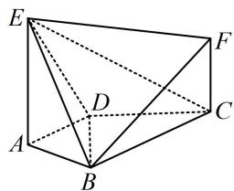

<!-- question-source:start -->
6. (2023·湖北模拟（节选）·★★)

如图， $AE \perp$ 平面ABCD， $BF / /$ 平面ADE， $CF / / AE$ ， $AD \perp AB$ ， $AB = AD = 2$ ， $AE = BC = 4$ ，证明： $AD / / BC.$

<!-- question-source:end -->

![[Q00050580A1]]
