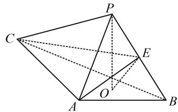

<!-- question-source:start -->
## 8.（2022·新课标Ⅱ卷（节选）·★★★）

如图， $PO$ 是三棱锥 $P - ABC$ 的高， $PA = PB$ ， $AB \perp AC$ ， $E$ 为 $PB$ 的中点，证明： $OE //$ 平面 $PAC$ .

一数·必刷100讲
<!-- question-source:end -->

![[Q00050582A1]]
