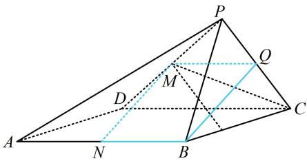

> [!faq]- 《第1节 平行关系证明思路大全》参考答案
>
> > [!success]- **【答案】** 详见解析
>
> > [!note]- **【分析】**
> > 本题未单列分析。
>
> > [!note]- **【解析】**
> > 所以四边形 $MNBQ$ 是平行四边形，故 $MN \parallel BQ$
> >
> > 又因为 $BQ \subset$ 平面 $PBC, MN \notin$ 平面 $PBC$ ,
> >
> > 所以 $MN / /$ 平面PBC.
> >
> > 
