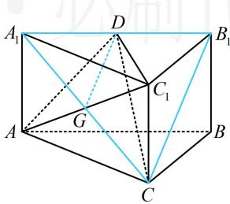

> [!faq]- 《第1节 平行关系证明思路大全》参考答案
>
> > [!success]- **【答案】** 详见解析
>
> > [!note]- **【分析】**
> > 本题未单列分析。
>
> > [!note]- **【解析】**
> > 证明：(观察发现 $B_{1} C$ 和 $A_{1}$ 位于面 $A C_{1} D$ 两侧, 由内容提要
> >
> > 2的①可知只需连接 $A_{1}C$ ，证明 $B_{1}C / / DG$ 即可）
> >
> > 如图，取 $AC_{1}$ 中点 $G$ ，连接 $DG$ ， $A_{1}C$ ，因为 $ABC - A_{1}B_{1}C_{1}$ 是直三棱柱，所以四边形 $ACC_{1}A_{1}$ 是矩形，
> >
> > 从而 $A_{1}$ ， $G$ ， $C$ 三点共线，且 $G$ 为 $A_{1}C$ 的中点，
> >
> > 又因为 D 为 $A_{1}B_{1}$ 的中点，所以 $DG \parallel B_{1}C$ ，
> >
> > 因为 $B_{1}C \not\subset$ 平面 $AC_{1}D$ ， $DG \subset$ 平面 $AC_{1}D$
> >
> > 所以 $B_{1}C \parallel$ 平面 $AC_{1}D$ .
> >
> > 
