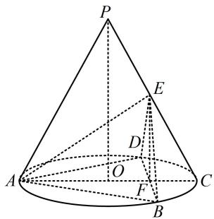

> [!faq]- 《第1节 平行关系证明思路大全》参考答案
>
> > [!success]- **【答案】** 详见解析
>
> > [!note]- **【分析】**
> > 本题未单列分析。
>
> > [!note]- **【解析】**
> > 证明：（观察发现 $PO$ 和 $C$ 位于面 $BDE$ 两侧，由内容提要2
> >
> > 的①可知只需证 $PO / /$ 面 $POC$ 与面 $BDE$ 的交线 $EF$ , 可尝试通过分析 $E, F$ 在 $PC, OC$ 上的位置来证明)
> >
> > 设 $AC \cap BD = F$ ，连接 $EF$ ，由题意， $\triangle ABD$ 是边长为 $\sqrt{3}$ 的正三角形， $O$ 是其外心，所以 $F$ 是 $BD$ 的中点，
> >
> > 且 $OA = \frac{2}{3} AF = \frac{2}{3}\times \frac{\sqrt{3}}{2}\times \sqrt{3} = 1$ ， $OF = \frac{1}{2} OA = \frac{1}{2},$
> >
> > 所以 OC = 1，AC = 2，且 F 是 OC 的中点，
> >
> > 又 $AE = \sqrt{3}$ ， $CE = 1$ ，所以 $AE^2 + CE^2 = 4 = AC^2$
> >
> > 故 $AE \perp PC$ ，且 $\cos\angle ACE=\frac{CE}{AC}=\frac{1}{2}$ ，
> >
> > 所以 $\angle ACE = 60^{\circ}$ ，结合 $PA = PC$ 得 $\triangle PAC$ 是正三角形，
> >
> > 又因为 $AE \perp PC$ ，所以 $E$ 为 $PC$ 中点，
> >
> > 结合 F 为 OC 中点可得 $EF \parallel PO$ ，因为 $PO \not\subset$ 平面 BDE，
> >
> > $EF \subset$ 平面 $BDE$ ，所以 $PO \parallel$ 平面 $BDE$ .
> >
> > 
