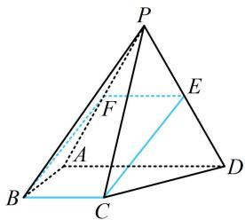

> [!faq]- 《第1节 平行关系证明思路大全》参考答案
>
> > [!success]- **【答案】** 详见解析
>
> > [!note]- **【分析】**
> > 本题未单列分析。
>
> > [!note]- **【解析】**
> > 证明：(要证线面平行, 先找线线平行. 可过 $B$ 作 $CE$ 的平
> >
> > 行线，作好就发现 BCEF 像平行四边形，如下图，故尝试证明）如图，取 PA 中点 F，连接 BF，EF，
> >
> > 因为 $E$ 是 $PD$ 中点，所以 $EF \parallel AD$ 且 $EF = \frac{1}{2} AD$ ①，
> >
> > （还需再证 $BC$ 也平行且等于 $AD$ 的一半，条件并未给出 $BC \parallel AD$ ，给的是 $BC \parallel$ 平面 $PAD$ ，故考虑线面平行的性质定理）因为 $BC \parallel$ 平面 $PAD$ ， $BC \subset$ 平面 $ABCD$ ，平面 $ABCD$
> >
> > ∩平面 PAD = AD，所以 $BC \parallel AD$ ，
> >
> > 又 $BC = \frac{1}{2} AD = 1$ ，结合①可得 $BC / / EF$ 且 $BC = EF$ ，
> >
> > 所以四边形 BCEF 是平行四边形，故 CE // BF，
> >
> > 因为 $CE \not\subset$ 平面 $PAB, BF \subset$ 平面 $PAB,$
> >
> > 所以 $CE \parallel$ 平面 $PAB$ .
> >
> > 
