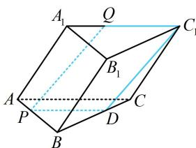
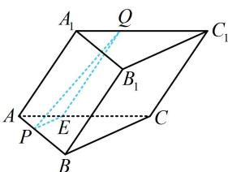

> [!faq]- 《第1节 平行关系证明思路大全》参考答案
>
> > [!success]- **【答案】** 详见解析
>
> > [!note]- **【分析】**
> > 本题未单列分析。
>
> > [!note]- **【解析】**
> > 证法1: (先过 $C_{1}$ 作 $PQ$ 的平行线, 观察发现 $PQC_{1}D$ 像平行
> >
> > 四边形，思路就有了）
> >
> > 如图1，作 $PD / / AC$ 交 $BC$ 于 $D$ ，则 $\triangle BPD$ 是正三角形，
> >
> > 设 $AP = A_{1}Q = x(0 < x < 2)$ ，则 $BP = 2 - x$ ，故 $PD = 2 - x$ ，
> >
> > 又 $C_1Q = A_1C_1 - A_1Q = 2 - x$ ，所以 $PD = C_1Q$
> >
> > 因为 $C_1Q \parallel AC$ ， $PD \parallel AC$ ，所以 $C_1Q \parallel PD$
> >
> > 从而四边形 $PQC_{1}D$ 是平行四边形，故 $PQ \parallel C_{1}D$
> >
> > 因为 $PQ \not\subset$ 平面 $BCC_{1}B_{1}$ ， $C_{1}D \subset BCC_{1}B_{1}$
> >
> > 所以 $PQ \parallel$ 平面 $BCC_{1}B_{1}$ .
> >
> > 证法2: (若没想到构造平行四边形, 也可尝试造面, 不妨先过 $P$ 作面 $BCC_{1}B_{1}$ 的平行线)
> >
> > 如图2，作 $PE / / BC$ 交 $AC$ 于 $E$ ，连接 $QE$
> >
> > 因为 $PE \not\subset$ 平面 $BCC_{1}B_{1}$ ， $BC \subset$ 平面 $BCC_{1}B_{1}$ ，
> >
> > 所以 $PE \parallel$ 平面 $BCC_{1}B_{1}$ ①,
> >
> > 由题意， $\triangle ABC$ 是正三角形，所以 $\triangle APE$ 也是正三角形，
> >
> > 故 $AE = AP$ ，又 $AP = A_{1}Q$ ，所以 $AE = A_{1}Q$
> >
> > 结合 $AE \parallel A_{1}Q$ 可得四边形 $AA_{1}QE$ 是平行四边形，
> >
> > 所以 $QE \parallel AA_{1}$ ，又 $AA_{1} \parallel CC_{1}$ ，所以 $QE \parallel CC_{1}$ ，
> >
> > 因为 $QE \not\subset$ 平面 $BCC_{1}B_{1}$ ， $CC_{1} \subset$ 平面 $BCC_{1}B_{1}$ ，
> >
> > 所以 $QE \parallel$ 平面 $BCC_{1}B_{1}$ ②，
> >
> > 因为 $QE$ ， $PE\subset$ 平面 $PQE$ ， $QE\cap PE = E$
> >
> > 结合①②可得平面 $PQE \parallel$ 平面 $BCC_{1}B_{1}$ ，
> >
> > 因为 $PQ \subset$ 平面 PQE，所以 $PQ \parallel$ 平面 $BCC_{1}B_{1}$ .
> >
> >   
> > 图1
> >
> >   
> > 图2
