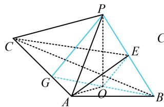
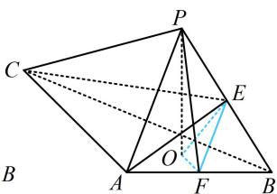

> [!faq]- 《第1节 平行关系证明思路大全》参考答案
>
> > [!success]- **【答案】** 详见解析
>
> > [!note]- **【分析】**
> > 本题未单列分析。
>
> > [!note]- **【解析】**
> > 证法1：（观察发现 $OE$ 和 $B$ 在面PAC的同侧，符合内容提
> >
> > 要2中②的情况，故可通过延长BO找平行线）
> >
> > 连接 $OA$ ，延长 $BO$ 交 $AC$ 于点 $G$ ，连接 $PG$ ，如图1，
> >
> > (要证 $OE \parallel PG$ , 结合 $E$ 为 $PB$ 中点知只需证 $O$ 为 $BG$ 中点, 注意到 $\angle BAG = 90^{\circ}$ , 故又只需证 $AO = OB$ )
> >
> > 因为 $PO$ 是三棱锥 $P - ABC$ 的高，所以 $PO \perp$ 平面 $ABC$
> >
> > 又 $OA$ ， $OB\subset$ 平面 $ABC$ ，故 $PO\bot OA$ ， $PO\bot OB$
> >
> > 结合 $PA = PB$ ， $PO = PO$ 可得 $\triangle POA\cong \triangle POB$ ，
> >
> > 所以 $OA = OB$ ，又 $AB \perp AC$ ，所以 $O$ 为 $BG$ 中点，
> >
> > 因为 E 为 PB 中点，所以 $OE \parallel PG$ ，因为 $OE \not\subset$ 平面 PAC，
> >
> > $PG \subset$ 平面 PAC，所以 $OE \parallel$ 平面 PAC.
> >
> > 证法2：（若没想到证法1的方法，也可通过造面来证结论，不妨先过点 $E$ 作 $PA$ 的平行线交 $AB$ 于 $F$ ， $F$ 应为 $AB$ 的中点，观察发现构造的面即为EOF，思路就有了）
> >
> > 取 $AB$ 中点 $F$ ，连接 $EF$ ，OF，PF，如图2，
> >
> > 因为 E 是 PB 中点，所以 $EF \parallel PA$ ，又 $EF \not\subset$ 平面 PAC，
> >
> > $PA \subset$ 平面 PAC，所以 $EF \parallel$ 平面 PAC ①;
> >
> > (再证 $OF \parallel$ 平面 $PAC$ , 只需证 $OF \parallel AC$ , 结合 $AC \perp AB$ 知又只需证 $OF \perp AB$ )
> >
> > 因为 $PO$ 是三棱锥 $P - ABC$ 的高，所以 $PO \perp$ 平面 $ABC$
> >
> > 又 $AB \subset$ 平面 $ABC$ ，所以 $AB \perp PO$ ，
> >
> > 因为 $PA = PB$ ，所以 $AB\bot PF$ ，而 $PO$ ， $PF\subset$ 平面 $POF$
> >
> > $PO \cap PF = P$ ，所以 $AB \perp$ 平面 POF，
> >
> > 因为 $OF \subset$ 平面 $POF$ ，所以 $OF \perp AB$ ，又 $AC \perp AB$ ，
> >
> > 且 $AC$ ，OF，AB都在平面ABC内，所以 $OF / / AC$
> >
> > 因为 $OF \not\subset$ 平面 $PAC, AC \subset$ 平面 $PAC,$
> >
> > 所以 $OF \parallel$ 平面 $PAC$ ②;
> >
> > 因为 $OF$ ， $EF\subset$ 平面 $OEF$ ， $OF\cap EF = F$
> >
> > 结合①②可得平面 $OEF / /$ 平面PAC，
> >
> > 又 $OE \subset$ 平面 $OEF$ , 所以 $OE \parallel$ 平面 $PAC$ .
> >
> >   
> > 图1
> >
> >   
> > 图2
>
> > [!tip]- **【反思】**
> > 证线面平行时，很多题目内容提要里涉及的三种思路常常都可以做，但复杂度可能有差异.
> >
> > 一数·必刷100讲
