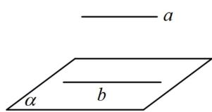
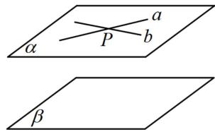
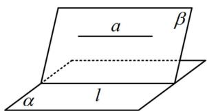
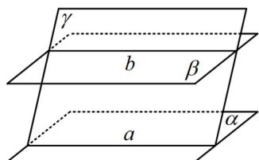
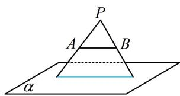

<!-- source-part:1 pages:1-8 -->

# 模块二 位置关系的判定

# 第1节 平行关系证明思路大全（★★）

## 内容提要

本节主要归纳立体几何大题第一问常见的证明平行关系的思路，先梳理需要用到的一些定理.

①线面平行的判定定理：如图1，若 $a \not\subset \alpha$ ， $b \subset \alpha$ ， $a \parallel b$ ，则 $a \parallel \alpha$ 。

②面面平行的判定定理：如图2，若 $a\subset\alpha,\ b\subset\alpha,\ a\cap b=P,\ a//\beta,\ b//\beta$ ，则 $\alpha//\beta$ .

③线面平行的性质定理：如图3，若 $a / / \alpha$ ， $a\subset \beta$ ， $\alpha \cap \beta = l$ ，则 $a / / l$

④面面平行的性质定理1：如图4，若 $\alpha // \beta$ ， $\gamma \cap \alpha = a$ ， $\gamma \cap \beta = b$ ，则 $a // b$

⑤面面平行的性质定理2：如图2，若 $\alpha // \beta$ ， $a \subset \alpha$ ，则 $a // \beta$

  
图1

  
图2

  
图3

  
图4

平行关系的证明题中，最常见的是证线面平行，以下是三大作辅助线的思路：

1. 找平行四边形：可先在面内作一条与已知直线平行的直线，观察构成的图形像不像平行四边形，若像，就尝试去找理由，进行论证即可.

2. 两个重要图形的运用（其原理是上面的线面平行的性质定理，运用时选①还是②，一般看图就知道）

①点线位于面的两侧：如图5，要证 $AB \parallel \alpha$ ，可在 $\alpha$ 的另一侧尝试找一点 $P$ ，连接 $PA, PB,$ 则面 $PAB$ 与 $\alpha$ 的交线就是我们证线面平行要找的 $\alpha$ 内的直线.

②点线位于面的同侧：如图6，要证 $AB \parallel \alpha$ ，可在 $\alpha$ 的同侧尝试找一点 $P$ ，连接 $PA, PB$ ，则面 $PAB$ 与 $\alpha$ 的交线就是我们证线面平行要找的 $\alpha$ 内的直线.

  
图5

  
图6

3. 造面面平行：若前面的两个方法都不易解决问题，那么还可以考虑通过证面面平行，来证明线面平行.

提醒：本节题目只节选了原题中的1个小问，所给条件可能有多余，这些条件是用在其它小问的。之所以没有把它们去掉，是因为应试时本来也需要我们去判断该用哪些条件去证明结论。

![[高中/总复习/教辅/一数常规版2026/第9章 立体几何、空间向量/模块2 位置关系的判定/第1节 平行关系证明思路大全/类型01_找平行四边形/类型01_找平行四边形.md]]
![[高中/总复习/教辅/一数常规版2026/第9章 立体几何、空间向量/模块2 位置关系的判定/第1节 平行关系证明思路大全/类型02_两个重要图形的运用/类型02_两个重要图形的运用.md]]
![[高中/总复习/教辅/一数常规版2026/第9章 立体几何、空间向量/模块2 位置关系的判定/第1节 平行关系证明思路大全/类型03_造面面平行的思路/类型03_造面面平行的思路.md]]
![[高中/总复习/教辅/一数常规版2026/第9章 立体几何、空间向量/模块2 位置关系的判定/第1节 平行关系证明思路大全/类型04_线面平行_面面平行的性质定理的应用/类型04_线面平行_面面平行的性质定理的应用.md]]
![[高中/总复习/教辅/一数常规版2026/第9章 立体几何、空间向量/模块2 位置关系的判定/第1节 平行关系证明思路大全/强化训练/强化训练.md]]
